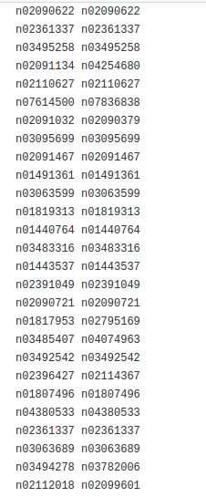

# Scripts

Contains some scripts :-  
1. <h5>accuracy.py </h5> calculating accuracy if input file contains classes for actual and predict.  
   Input file format :  
     
   <h6>Run:</h6> <h6>$ python3 accuracy.py filename.txt engine_no model_name TOTAL_CLASS </h6>  
   model_name : any string  
   TOTAL_CLASS :- any int i.e 5000 (for Imagenet)    
   Output file format : .txt file bool {True: if correct prediction else False}  

2. <h5>accuracy.py </h5> calculating no of mispredictions across 2 engine files.  
   Input file format : 2 output files generated from parse script  
                       [Actual | Predict]
                       
